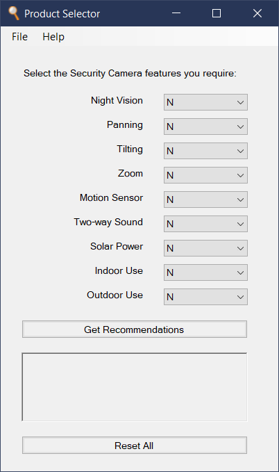

Product Selector
================

Product Selector is a template application that accepts a CSV or Excel file
containing correctly formatted product details.

The supplied information is converted into a simple application that makes purchase
recommendations based on the required features selected by a user.

Any type of product can be used as the basis for an application,
and the number of models that can be included is not limited.

Whether each model has one of a small set of key features should be specified
in the file used to generate the application, along with its price and overall rating.

A sample CSV file with the correct formatting can be seen `here`_.

The Windows version of the application created with this data
looks like this:

|

|
|

| This cross-platform app was generated by `Briefcase`_ - part of `The BeeWare Project`_.
| If you want to see more tools like Briefcase, please consider `becoming a financial member of BeeWare`_.

.. _`here`: https://github.com/jonboland/productselector/blob/master/src/productselector/securitycameras2.csv
.. _`Briefcase`: https://github.com/beeware/briefcase
.. _`The BeeWare Project`: https://beeware.org/
.. _`becoming a financial member of BeeWare`: https://beeware.org/contributing/membership
