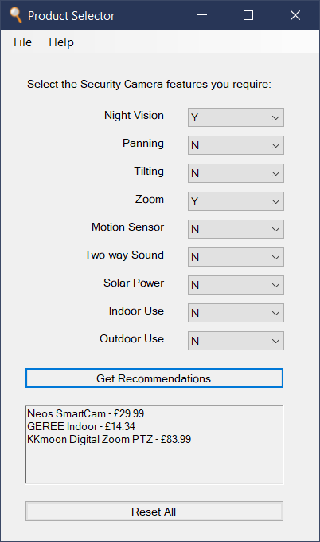

Product Selector
================

Product Selector reads a CSV or Excel file containing product details
and converts them into a simple application that makes purchase
recommendations based on the required features selected by a user.

Any type of product can form the basis of an application,
and the number of product models which can be included is not limited.

The file used to generate the application should state whether each model
has a small set of key features, along with the model's price and overall rating.

File name, maximum number of results to display, and the correct currency
are specified by updating the associated constants.

The necessary formatting can be seen in this `example Product Selector CSV file`_.

The Windows version of the application created with this example data looks like this:

|

|
The installer package file for this example application can be downloaded `here`_.

|
*This cross-platform app was generated by* `Briefcase`_ *- part of* `The BeeWare Project`_.
*If you want to see more tools like Briefcase, please consider* `becoming a financial member of BeeWare`_.

.. _`example Product Selector CSV file`: https://github.com/jonboland/productselector/blob/master/src/productselector/securitycameras2.csv
.. _`here`: https://github.com/jonboland/productselector/raw/master/msi/Product%20Selector-0.0.1.msi
.. _`Briefcase`: https://github.com/beeware/briefcase
.. _`The BeeWare Project`: https://beeware.org/
.. _`becoming a financial member of BeeWare`: https://beeware.org/contributing/membership
